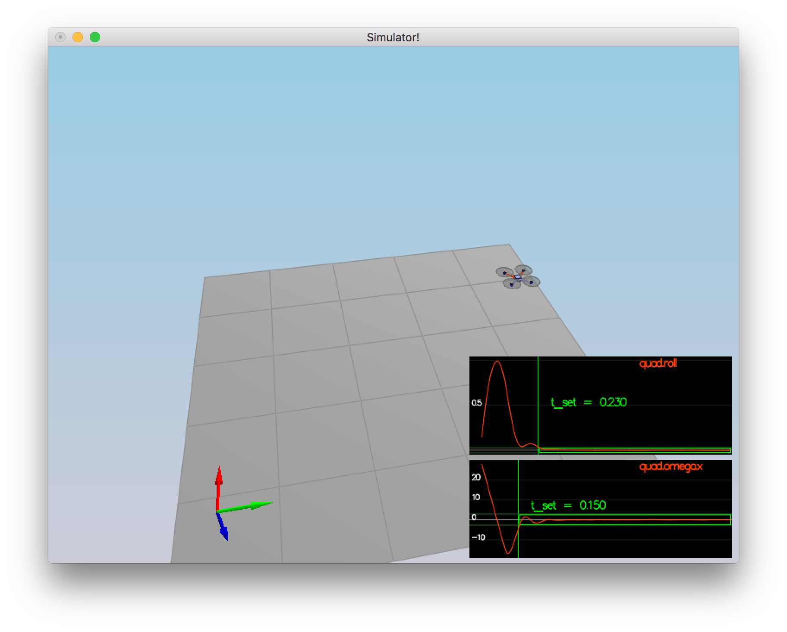
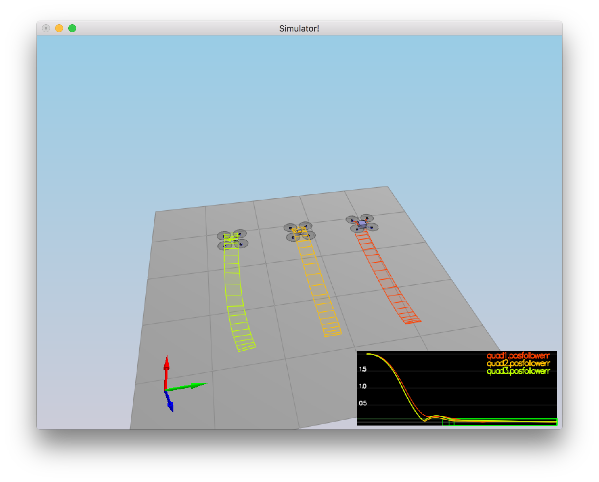
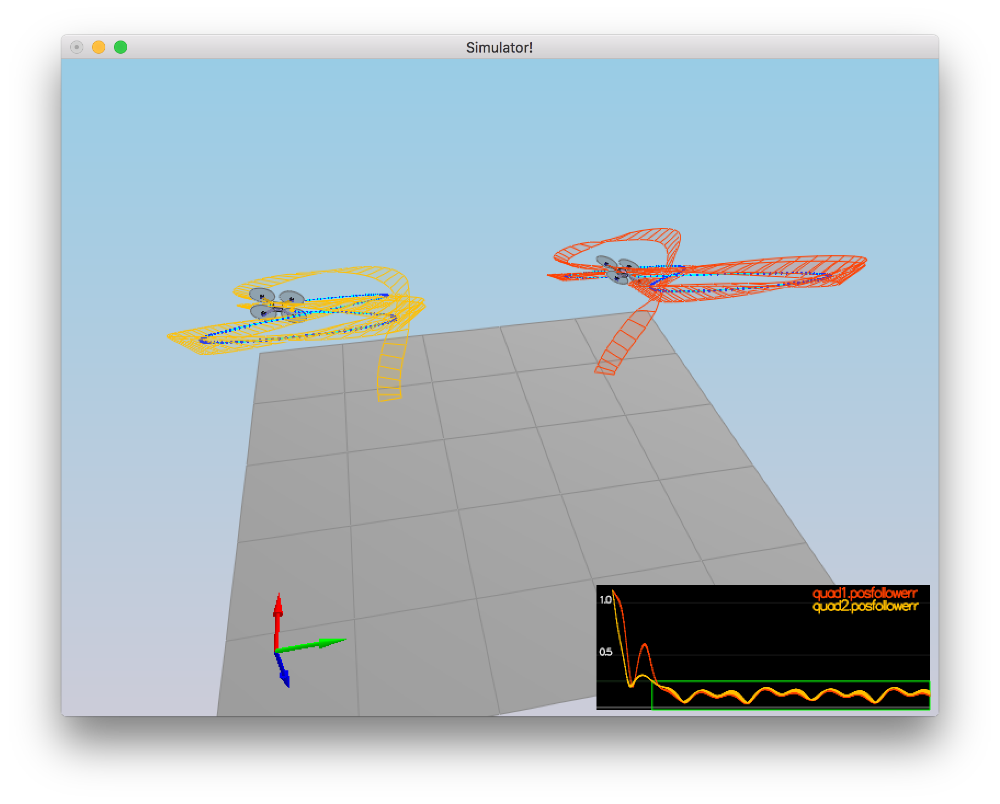

# The C++ Project Write-up #

## Body rate and roll/pitch control (scenario 2) ##

### Motor commands ###

Let us denote the desired thrust commands of the individual motors as
`F[0], F[1], F[2], F[3]` (front left, front right, rear left, rear right).
Let `L` be the length of the arm from the centre of Quadrocopter to individual
motor(s). Let `l` denote the perpendicular distance of motor(s) to axes, i.e.:

```
const float l = L / (2.f * sqrt(2.f));
```

We know that the collective thrust is:

```
collThrustCmd =  (F[0] + F[1] + F[2] + F[3])          # (1)
```

We also know that the desired rotation moments around the drone axes `x, y, z`
are:

```
momentCmd.x   =  (F[0] - F[1] + F[2] - F[3]) * l      # (2)
momentCmd.y   =  (F[0] + F[1] - F[2] - F[3]) * l      # (3)
momentCmd.z   = -(F[0] - F[1] - F[2] + F[3]) * kappa  # (4)
```

The the desired thrust commands `F[0], F[1], F[2], F[3]` are unknown, but
can be solved easily using the above equations `(1-4)`.

Let us denote (for convenience):

```
const float Fc = collThrustCmd;
const float Fx = momentCmd.x / l;
const float Fy = momentCmd.y / l;
const float Fz = -momentCmd.z / kappa;
```

One can easily see that:

```
F[0] = (Fc + Fx + Fy + Fz) / 4
F[1] = (Fc - Fx + Fy - Fz) / 4
F[2] = (Fc + Fx - Fy - Fz) / 4
F[3] = (Fc - Fx - Fy + Fz) / 4
```

To get the final individual motor thrust commands, we limit the computed
thrusts to be within the range: `[minMotorThrust, maxMotorThrust]`:

```
cmd.desiredThrustsN[0] = CONSTRAIN((Fc + Fx + Fy + Fz) / 4.f, minMotorThrust, maxMotorThrust);
cmd.desiredThrustsN[1] = CONSTRAIN((Fc - Fx + Fy - Fz) / 4.f, minMotorThrust, maxMotorThrust);
cmd.desiredThrustsN[2] = CONSTRAIN((Fc + Fx - Fy - Fz) / 4.f, minMotorThrust, maxMotorThrust);
cmd.desiredThrustsN[3] = CONSTRAIN((Fc - Fx - Fy + Fz) / 4.f, minMotorThrust, maxMotorThrust);
```

### Body rate control ###

Body rate control can be implemented as follows:

```
const V3F moi(Ixx, Iyy, Izz);
const V3F pqrErr = pqrCmd - pqr;
momentCmd = moi * kpPQR * pqrErr;
```

Where `moi` represents moments of inertia of the drone, and `momentCmd`
represents the desired moments for each of the axes: `x, y, z`.

### Roll / pitch control ###

First, we need to compute the collective acceleration [m/s2] of the four
propellers:

```
const float c = -collThrustCmd / mass;
```

Note that we put a negative sign here since the z-axis points downwards.

Then we use the equation (6) from the paper [Feed-Forward Parameter
Identification for Precise Periodic Quadrocopter Motions](http://www.dynsyslab.org/wp-content/papercite-data/pdf/schoellig-acc12.pdf),
where:

```
const float bxDotCmd =
  CONSTRAIN((accelCmd.x / c), -maxTiltAngle, maxTiltAngle) - R(0, 2);
const float byDotCmd =
  CONSTRAIN((accelCmd.y / c), -maxTiltAngle, maxTiltAngle) - R(1, 2);
```

The commanded angular body velocities can be computed as follows:

```
pqrCmd.x = kpBank * (R(1, 0) * bxDotCmd - R(0, 0) * byDotCmd) / R(2, 2);
pqrCmd.y = kpBank * (R(1, 1) * bxDotCmd - R(0, 1) * byDotCmd) / R(2, 2);
```

Tuning `kpPQR` and `kpBank` in `QuadControlParams.txt` (in order to prevent
spinning quickly and to minimize settling time) is quite easy, since there is
a wide range of parameters that work pretty well. We use rather conservative
values that will prove helpful in later scenarios:

```
# Angle control gains
kpBank = 15

# Angle rate gains
kpPQR = 46, 46, 10
```

Screenshot for the scenario `2_AttitudeControl`:



Console output:

```
Simulation #1 (../config/2_AttitudeControl.txt)
PASS: ABS(Quad.Roll) was less than 0.025000 for at least 0.750000 seconds
PASS: ABS(Quad.Omega.X) was less than 2.500000 for at least 0.750000 seconds
```

## Position/velocity and yaw angle control (scenario 3) ##

### Lateral position control ###

The unconstrained lateral position control can be implemented as follows:

```
const V3F accelCmd = 
  kpVelXY * (kpPosXY * (posCmd - pos) + velCmd - vel) + accelCmdFF;
```

However, in order to limit the maximum horizontal velocity and acceleration
to `maxSpeedXY` and `maxAccelXY` we introduce an auxiliary function:

```
V3F ConstrainXYNorm(const V3F& vec, float maxXYNorm) {
  const float vecXYNorm = vec.magXY();
  if (vecXYNorm > maxXYNorm) {
    return vec / vecXYNorm * maxXYNorm;
  }
  return vec;
}
```

`ConstrainXYNorm` shrinks the input vector `vec` in its `XY` coordinates if
its `XY` magnitude (norm) exceeds the given `maxXYNorm`.

The constrained lateral position control can be now implemented as follows:

```
const V3F accelCmd = ConstrainXYNorm(
  kpVelXY * (
    ConstrainXYNorm(kpPosXY * (posCmd - pos) + velCmd, maxSpeedXY) - vel) +
  accelCmdFF, maxAccelXY);
```

### Altitude control ###

The unconstrained altitude control can be computed as follows:

```
const float posErr = posZCmd - posZ;
const float accelZ = kpVelZ * (kpPosZ * posErr + velZCmd - velZ) + accelZCmd;
thrust = mass * (-accelZ + 9.81f) / R(2, 2);
```

Since the `z` axis points downwards, the upwards acceleration has a negative
sign. Therefore, we need to use `-accelZ` when computing the collective thrust
(in the upwards direction).

We can limit the maximum vertical speeds by `maxAscentRate` and
`maxDescentRate` as follows:

```
const float accelZ = kpVelZ * (CONSTRAIN(kpPosZ * posErr + velZCmd,
                                         -maxAscentRate, maxDescentRate) -
                               velZ) +
                     accelZCmd;
```

Note that we do not limit the resulting collective thrust command here.
Instead, we limit every motor thrust command individually in the method
`QuadControl::GenerateMotorCommands`.

### Yaw control ###

If we did not account for unwrapping radian angles, the yaw control could
be implemented as follows:

```
yawRateCmd = kpYaw * (yawCmd - yaw);
```

With radian angles unwrapping the yaw control gets slightly more complicated:

```
float yawErr = fmodf(yawCmd, 2*M_PI) - fmodf(yaw, 2*M_PI);
if (yawErr > M_PI) {
  yawErr -= 2*M_PI;
} else if (yawErr < -M_PI) {
  yawErr += 2*M_PI;
}
yawRateCmd = kpYaw * yawErr;
```

We have tuned the position and velocity control gains as follows:

```
# Position control gains
kpPosXY = 3
kpPosZ = 2.5

# Velocity control gains
kpVelXY = 12
kpVelZ = 10
```

Note that we maintain the property `kpVel = 4 * kpPos`.

Screenshot for the scenario `3_PositionControl`:


Console output:

```
Simulation #1 (../config/3_PositionControl.txt)
PASS: ABS(Quad1.Pos.X) was less than 0.100000 for at least 1.250000 seconds
PASS: ABS(Quad2.Pos.X) was less than 0.100000 for at least 1.250000 seconds
PASS: ABS(Quad2.Yaw) was less than 0.100000 for at least 1.000000 seconds
```

## Non-idealities and robustness (scenario 4) ##

Adding integral control to help with the different-mass vehicle(s) boils down
to updating and adding the term: `integratedAltitudeError` to the `accelZ`
estimate:

```
const float posErr = posZCmd - posZ;
integratedAltitudeError += posErr * dt;
const float accelZ = KiPosZ * integratedAltitudeError +
                     kpVelZ * (CONSTRAIN(kpPosZ * posErr + velZCmd,
                                         -maxAscentRate, maxDescentRate) -
                               velZ) +
                     accelZCmd;
```

The following control gains seem to work fine for this scenario:

```
# Position control gains
kpPosXY = 3
kpPosZ = 2.5
KiPosZ = 40

# Velocity control gains
kpVelXY = 12
kpVelZ = 10
```



Console output:

```
Simulation #1 (../config/4_Nonidealities.txt)
PASS: ABS(Quad1.PosFollowErr) was less than 0.100000 for at least 1.500000 seconds
PASS: ABS(Quad2.PosFollowErr) was less than 0.100000 for at least 1.500000 seconds
PASS: ABS(Quad3.PosFollowErr) was less than 0.100000 for at least 1.500000 seconds
```

## Tracking trajectories (scenario 5) ##

The drone (as tuned above) is able to follow the trajectory seamlessly:



Console output:

```
Simulation #1 (../config/5_TrajectoryFollow.txt)
PASS: ABS(Quad2.PosFollowErr) was less than 0.250000 for at least 3.000000 seconds
```

## Extra Challenge 1 (Optional) ##

It is quite straightforward to generate a trajectory that has velocity (not
just position) information (based on its `x, y, z` equations). One needs to
compute the `x, y, z` derivate(s) in order to get the corresponding velocities:

```
x = math.sin(t * 2 * math.pi / period[0] + phase[0]) * radius * amp[0] + center[0];
y = math.sin(t * 2 * math.pi / period[1] + phase[1]) * radius * amp[1] + center[1];
z = math.sin(t * 2 * math.pi / period[2] + phase[2]) * radius * amp[2] + center[2];
the_file.write(fmt(t) + "," + fmt(x) + "," + fmt(y) + "," + fmt(z));
######## BEGIN STUDENT CODE
vx = 2 * math.pi / period[0] * math.cos(t * 2 * math.pi / period[0] + phase[0]) * radius * amp[0];
vy = 2 * math.pi / period[1] * math.cos(t * 2 * math.pi / period[1] + phase[1]) * radius * amp[1];
vz = 2 * math.pi / period[2] * math.cos(t * 2 * math.pi / period[2] + phase[2]) * radius * amp[2];
######## END STUDENT CODE
the_file.write("," + fmt(vx) + "," + fmt(vy) + "," + fmt(vz));
```