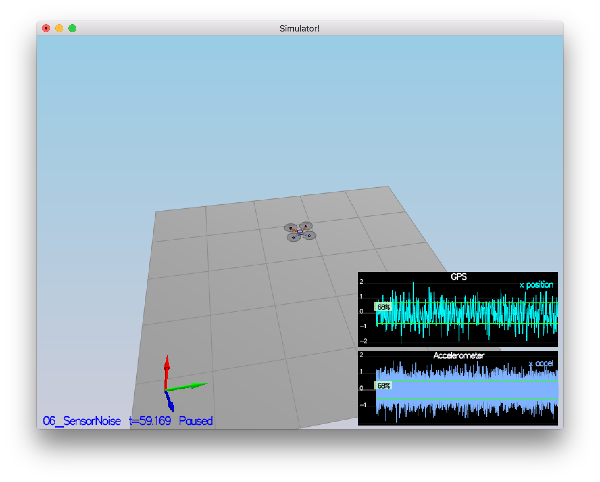
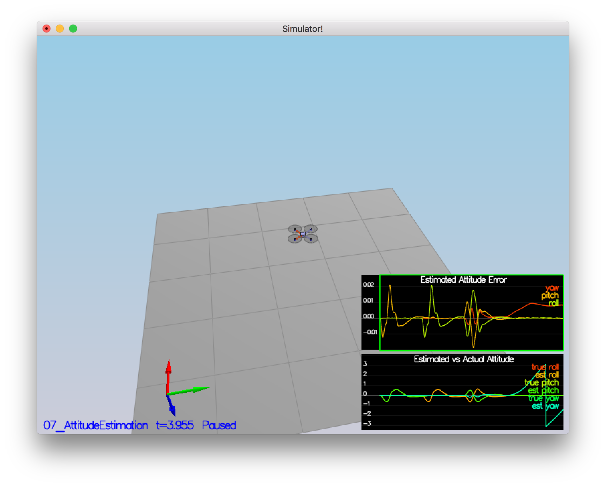
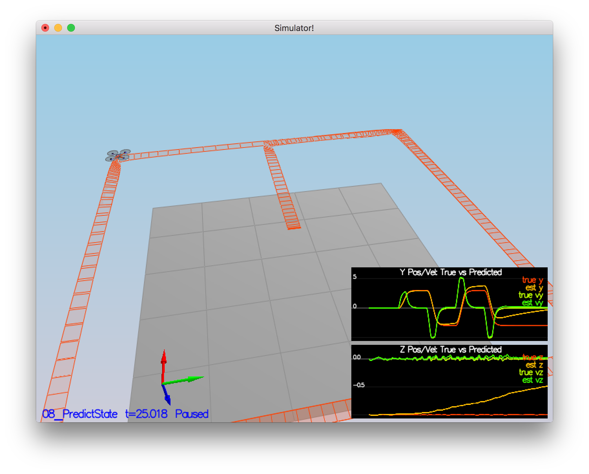
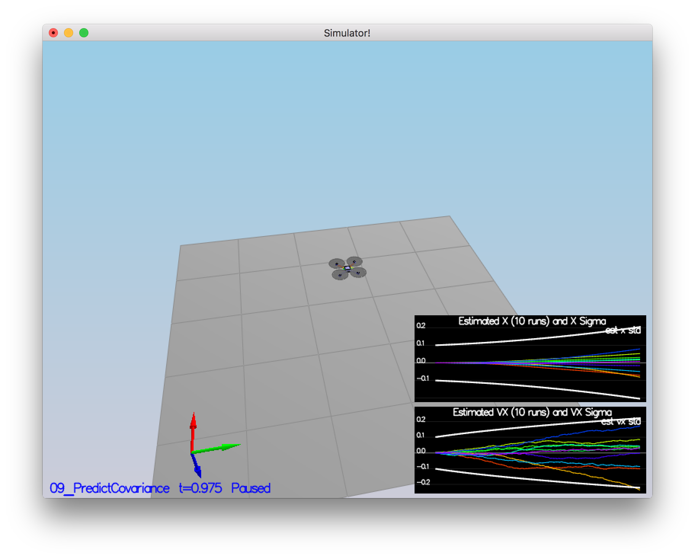
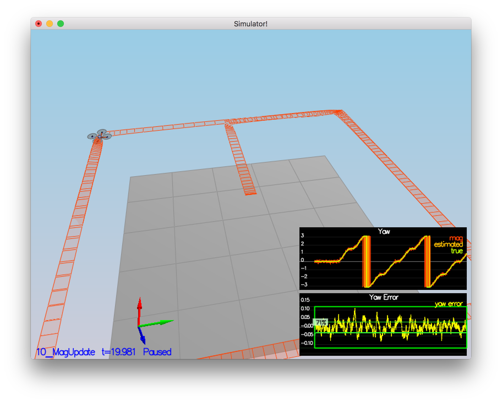
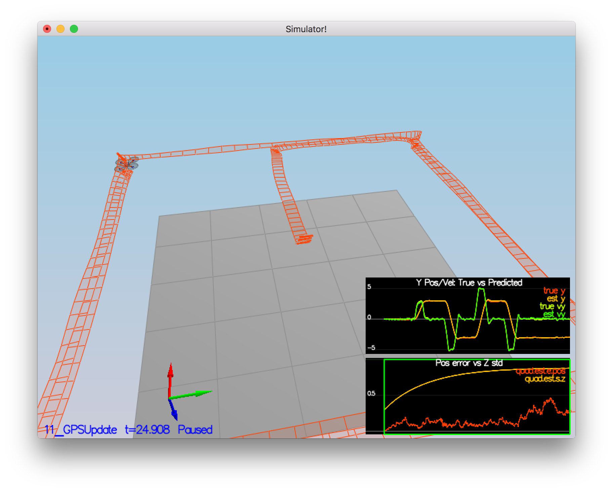

# Estimation Project #

### Step 1: Sensor Noise ###

For this task I have installed [Pandas](https://pandas.pydata.org/):

```
source activate fcnd
conda install pandas
```

Then, I have updated `06_SensorNoise.txt` to prolong the simulation as follows:

```
Sim.EndTime = 60
```

I ran the simulation `06_SensorNoise` and paused at `50` seconds.

Note: It was necessary to pause the simulation since the logs are cleared with
every restart. `50` seconds gave us enough data to get precise estimates.

Finally, I have processed the logs using the [Jupyter](http://jupyter.org/)
notebook `06_SensorNoise.ipynb` as follows:

```
import numpy as np
import pandas as pd

quad_gps_x_frame = pd.read_csv('config/log/Graph1.txt')
quad_gps_x_frame.columns = ['time', 'Quad.GPS.X']

quad_accel_x_frame = pd.read_csv('config/log/Graph2.txt')
quad_accel_x_frame.columns = ['time', 'Quad.IMU.AX']

MeasuredStdDev_GPSPosXY = np.std(quad_gps_x_frame['Quad.GPS.X'])
MeasuredStdDev_AccelXY = np.std(quad_accel_x_frame['Quad.IMU.AX'])
```

Output:

```
MeasuredStdDev_GPSPosXY = 0.70
MeasuredStdDev_AccelXY = 0.50
```

Screenshot for the scenario `06_SensorNoise`:



Console output:

```
Simulation #1 (../config/06_SensorNoise.txt)
PASS: ABS(Quad.GPS.X-Quad.Pos.X) was less than MeasuredStdDev_GPSPosXY for 68% of the time
PASS: ABS(Quad.IMU.AX-0.000000) was less than MeasuredStdDev_AccelXY for 68% of the time
```

### Step 2: Attitude Estimation ###

The nonlinear complementary filter for attitude estimation can be implemented
as follows (based on Section 7.1.2 of [Estimation for Quadrotors](https://www.overleaf.com/read/vymfngphcccj#/54894644/)):

```
auto qt = Quaternion<float>::FromEuler123_RPY(rollEst, pitchEst, ekfState(6));
auto qt_bar = qt.IntegrateBodyRate(V3D(gyro.x, gyro.y, gyro.z), dtIMU);

float predictedPitch = qt_bar.Pitch();
float predictedRoll = qt_bar.Roll();
ekfState(6) = qt_bar.Yaw();  // yaw
```

Screenshot for the scenario `07_AttitudeEstimation`:



Console output:

```
Simulation #1 (../config/07_AttitudeEstimation.txt)
PASS: ABS(Quad.Est.E.MaxEuler) was less than 0.100000 for at least 3.000000 seconds
```

### Step 3: Prediction Step ###

The transition function from Section 7.2 of
[Estimation for Quadrotors](https://www.overleaf.com/read/vymfngphcccj#/54894644/)
can be implemented as follows:

```
// Acceleration of the vehicle in the inertial frame
const V3F a = attitude.Rotate_BtoI(accel);

predictedState(0) = curState(0) + curState(3) * dt;
predictedState(1) = curState(1) + curState(4) * dt;
predictedState(2) = curState(2) + curState(5) * dt;
predictedState(3) = curState(3) + a.x * dt;
predictedState(4) = curState(4) + a.y * dt;
predictedState(5) = curState(5) - 9.81f * dt + a.z * dt;
predictedState(6) = curState(6);
```

The estimator state tracks the actual state with only reasonably slow drift.

Screenshot for the scenario `08_PredictState`:



The partial derivative of the body-to-global rotation matrix in the function
`GetRbgPrime()` can be calculated as follows:

```
RbgPrime(0, 0) = -cos(pitch) * sin(yaw);
RbgPrime(0, 1) = -sin(roll) * sin(pitch) * sin(yaw) - cos(roll) * cos(yaw);
RbgPrime(0, 2) = -cos(roll) * sin(pitch) * sin(yaw) + sin(roll) * cos(yaw);
RbgPrime(1, 0) = +cos(pitch) * cos(yaw);
RbgPrime(1, 1) = +sin(roll) * sin(pitch) * cos(yaw) - cos(roll) * sin(yaw);
RbgPrime(1, 2) = +cos(roll) * sin(pitch) * cos(yaw) + sin(roll) * sin(yaw);
```

We can then plug the `RbgPrime` into the computation of the Jacobian `gPrime`
in the function `Predict()` as follows:

```
MatrixXf accelMat(3, 1);
accelMat(0, 0) = accel.x;
accelMat(1, 0) = accel.y;
accelMat(2, 0) = accel.z;
const MatrixXf RgbPrime = GetRbgPrime(rollEst, pitchEst, ekfState(6));
const MatrixXf RgbAccel = RgbPrime * accelMat * dt;
gPrime(0, 3) = dt;
gPrime(1, 4) = dt;
gPrime(2, 5) = dt;
gPrime(3, 6) = RgbAccel(0, 0);
gPrime(4, 6) = RgbAccel(1, 0);
gPrime(5, 6) = RgbAccel(2, 0);
```

The equation to update the covariance matrix `ekfCov` is then:

```
ekfCov = gPrime * ekfCov * gPrime.transpose() + Q;
```

If we tune the `QPosXYStd` and the `QVelXYStd` process parameters in
`QuadEstimatorEKF.txt` as follows:

```
QPosXYStd = .1
QVelXYStd = .2
```

We end up with a covariance growing similarly as the actual error.

Screenshot for the scenario `09_PredictCovariance`:



### Step 4: Magnetometer Update ###

Following Section 7.3.2 of [Estimation for Quadrotors]
(https://www.overleaf.com/read/vymfngphcccj#/54894644/)
the equations for `zFromX` and `hPrime` for Magnetometer can be written as
follows:

```
float estYaw = ekfState(6);
if (estYaw - magYaw > +F_PI) estYaw -= 2.f*F_PI;
if (estYaw - magYaw < -F_PI) estYaw += 2.f*F_PI;

zFromX(0) = estYaw;
hPrime(0, 6) = 1;
```

Tuning the parameter `QYawStd` from `QuadEstimatorEKF.txt` as:

```
QYawStd = .1
```

approximately captures the magnitude of the drift.

Screenshot for the scenario `10_MagUpdate`:



Console output:

```
Simulation #1 (../config/10_MagUpdate.txt)
PASS: ABS(Quad.Est.E.Yaw) was less than 0.120000 for at least 10.000000 seconds
PASS: ABS(Quad.Est.E.Yaw-0.000000) was less than Quad.Est.S.Yaw for 71% of the time
```

### Step 5: Closed Loop + GPS Update ###

First, we set `Quad.UseIdealEstimator` to `0` in `config/11_GPSUpdate.txt`
and then use the realistic IMU in order to properly tune the process noise
model in `QuadEstimatorEKF.txt` as follows:

```
QPosZStd = .2
```

Then, following Section 7.3.1 of [Estimation for Quadrotors](https://www.overleaf.com/read/vymfngphcccj#/54894644/)
the equations for `zFromX` and `hPrime` for GPS can be written as follows:

```
zFromX(0) = ekfState(0);
zFromX(1) = ekfState(1);
zFromX(2) = ekfState(2);
zFromX(3) = ekfState(3);
zFromX(4) = ekfState(4);
zFromX(5) = ekfState(5);
hPrime.setIdentity();
```

It turns out that doubling / tripling the default GPS measurement std
deviations leads to much better performance:

```
GPSPosXYStd = 3
GPSPosZStd = 9
GPSVelXYStd = .2
GPSVelZStd = .6
```

Screenshot for the scenario `11_GPSUpdate`:


Console output:

```
Simulation #1 (../config/11_GPSUpdate.txt)
PASS: ABS(Quad.Est.E.Pos) was less than 1.000000 for at least 20.000000 seconds
```

### Step 6: Adding Your Controller ###

It turns out that the controller I wrote in the last project works
out-of-the-box. No tuning was needed.

Screenshot for the scenario `11_GPSUpdate`:



Console output:

```
Simulation #1 (../config/11_GPSUpdate.txt)
PASS: ABS(Quad.Est.E.Pos) was less than 1.000000 for at least 20.000000 seconds
```
